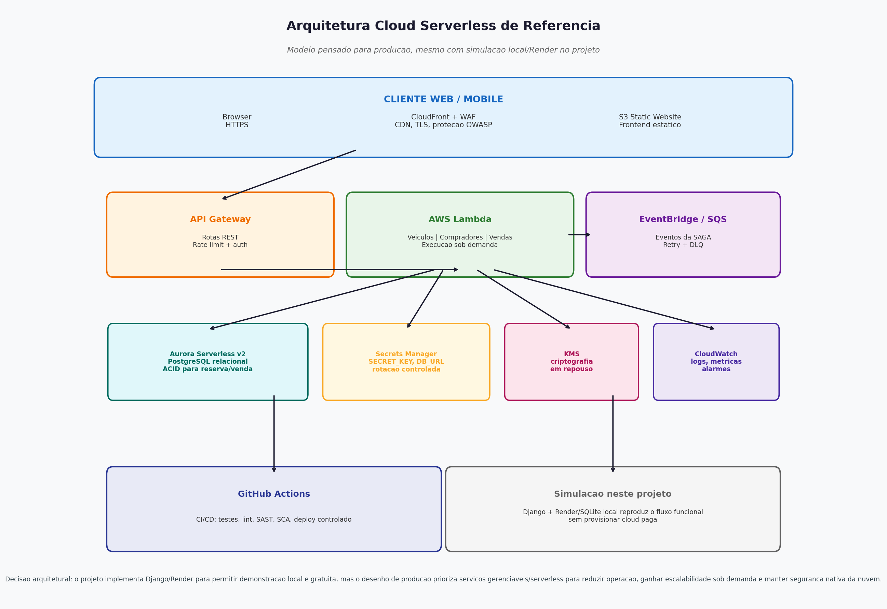

# Desenho de Arquitetura - Plataforma de Revenda de Veiculos

## 1. Visao Geral

A plataforma foi construida como uma aplicacao web monolitica utilizando Django + Django REST Framework, priorizando simplicidade, economia de recursos e facilidade de deploy em servicos gratuitos ou gerenciaveis na nuvem.

O repositorio permite rodar tudo localmente para demonstracao e gravacao do video. Ainda assim, a arquitetura foi pensada para evoluir para um desenho cloud com servicos serverless e gerenciaveis, reduzindo operacao manual e ganhando escalabilidade sob demanda.

## 2. Diagrama de Arquitetura Executavel

O diagrama acima apresenta a visao executavel da solucao em camadas, usada para rodar localmente e simular o deploy em ambiente gerenciavel:

1. **Camada Cliente**: Browser do usuario acessando o frontend (Django Templates + Bootstrap 5) ou consumindo a API REST (JSON).
2. **Camada de Transporte**: Toda comunicacao e feita via HTTPS/TLS em producao, com certificado SSL gerenciado automaticamente pelo Render.
3. **Camada de Aplicacao**: Django Application rodando sobre Gunicorn (WSGI) com 2 workers, contendo os apps Veiculos, Compradores e Vendas, alem de Django REST Framework e modulos de seguranca.
4. **Camada de Dados**: PostgreSQL gerenciado pelo Render em producao ou SQLite local para demonstracao, armazenando veiculos, compradores, vendas e historico de auditoria.

## 3. Arquitetura Cloud Serverless de Referencia

Mesmo que o projeto nao provisione uma nuvem paga, a solucao foi pensada para uma evolucao serverless/gerenciavel em producao. O objetivo e demonstrar que a aplicacao pode sair do modo de simulacao local/Render e evoluir para servicos cloud com menor operacao manual, escalabilidade sob demanda e seguranca nativa.

Componentes propostos para a arquitetura alvo:

1. **CloudFront + WAF**: Distribuicao global, TLS gerenciado, cache e protecao contra ataques comuns da OWASP.
2. **S3 Static Website**: Hospedagem de frontend estatico caso a interface seja separada do Django no futuro.
3. **API Gateway**: Publicacao das rotas REST com throttling, autenticacao e controle de entrada.
4. **AWS Lambda**: Execucao sob demanda das regras de negocio de veiculos, compradores e vendas, sem gerenciar servidores.
5. **EventBridge/SQS**: Desacoplamento dos eventos da SAGA, com retentativas, filas e dead-letter queue para falhas.
6. **Aurora Serverless v2 (PostgreSQL)**: Banco relacional gerenciavel e elastico, preservando transacoes ACID importantes para reserva e venda.
7. **Secrets Manager + KMS**: Gestao segura de segredos e criptografia de dados em repouso.
8. **CloudWatch**: Logs, metricas e alarmes para observabilidade operacional.

Essa arquitetura e o desenho de producao recomendado. A implementacao deste repositorio usa Django + Render/SQLite local para permitir execucao gratuita e gravacao do video sem depender de conta cloud paga.

O codigo de infraestrutura correspondente esta em [`infra/serverless`](../infra/serverless/README.md). Ele foi criado como referencia de IaC para a arquitetura alvo, sem exigir provisionamento real para a entrega.

## 4. Componentes e Justificativas

### 4.1 Django + Django REST Framework

- **Por que escolhemos**: Framework Python maduro, com ORM robusto, sistema de autenticacao integrado, admin automatico e ecossistema rico. Ideal para prototipacao rapida com qualidade de producao.
- **Economia de recursos**: Uma unica aplicacao serve tanto a API REST quanto o frontend com templates, eliminando a necessidade de um servidor frontend separado.
- **Aderencia ao modelo serverless futuro**: A separacao por apps e services permite migrar gradualmente rotas ou casos de uso para funcoes Lambda, se necessario.

### 4.2 Render (PaaS) - Servico Gerenciavel na Nuvem

- **Por que escolhemos**: Oferece plano gratuito, deploy automatico via GitHub, SSL gratuito e banco gerenciado. Elimina a necessidade de gerenciar servidores, patches e infraestrutura.
- **Papel no trabalho**: Serve como ambiente gerenciavel para demonstracao e gravacao, sem custo e sem complexidade de provisionar AWS.
- **Relacao com serverless**: Nao e serverless puro como Lambda, mas segue o mesmo principio de reduzir operacao manual e transferir infraestrutura para a plataforma.

### 4.3 PostgreSQL Gerenciado / Aurora Serverless

- **Por que escolhemos SQL**: O fluxo de reserva e venda precisa de transacoes ACID, locks pessimistas e consistencia forte para evitar venda dupla do mesmo veiculo.
- **No projeto executavel**: PostgreSQL gerenciado pelo Render em producao ou SQLite local para simulacao.
- **Na arquitetura alvo**: Aurora Serverless v2 com PostgreSQL seria a alternativa cloud para escalar automaticamente mantendo o modelo relacional.

### 4.4 WhiteNoise e Arquivos Estaticos

- **No projeto executavel**: WhiteNoise serve arquivos estaticos diretamente do Django, reduzindo custo e complexidade.
- **Na arquitetura alvo**: S3 + CloudFront poderia assumir a distribuicao estatica, com cache global e TLS gerenciado.

### 4.5 Gunicorn / AWS Lambda

- **No projeto executavel**: Gunicorn executa a aplicacao Django como servidor WSGI de producao.
- **Na arquitetura alvo**: AWS Lambda executaria rotas e regras de negocio sob demanda, atras de API Gateway, reduzindo custo quando nao houver trafego.

## 5. Servicos de Seguranca na Nuvem

### 5.1 Render SSL/TLS ou CloudFront TLS

- **O que e**: Certificados SSL/TLS gerenciados pela plataforma.
- **Por que usamos**: Garante trafego criptografado, previne interceptacao de credenciais e evita gerenciamento manual de certificados.

### 5.2 WAF e Protecao de Borda

- **No desenho serverless**: AWS WAF na frente do CloudFront/API Gateway protege contra ataques comuns, rate limiting abusivo e padroes conhecidos da OWASP.
- **No projeto executavel**: A aplicacao usa middlewares do Django e configuracoes seguras para simular as protecoes de aplicacao.

### 5.3 Django Security Middleware

- **SecurityMiddleware**: Headers HTTP de seguranca, HSTS em producao e redirecionamento para HTTPS.
- **CsrfViewMiddleware**: Token CSRF em formularios, prevenindo Cross-Site Request Forgery.
- **ClickjackingMiddleware**: `X-Frame-Options: DENY`, prevenindo uso malicioso em iframes.
- **Cookies seguros**: Cookies Secure e HttpOnly em producao.

### 5.4 Hashing de Dados Sensiveis

- **O que e**: CPF e RG sao armazenados como hashes SHA-256. Apenas dados mascarados aparecem na interface.
- **Por que usamos**: Mesmo em caso de vazamento, os documentos originais nao ficam expostos diretamente, reduzindo risco LGPD.

### 5.5 Secrets Manager / Variaveis de Ambiente

- **No projeto executavel**: SECRET_KEY, DATABASE_URL e demais configuracoes sensiveis sao carregadas por variaveis de ambiente.
- **Na arquitetura alvo**: AWS Secrets Manager centralizaria segredos com controle de acesso e rotacao.

### 5.6 KMS, Logs e Observabilidade

- **KMS**: Criptografia de dados em repouso.
- **CloudWatch**: Logs, metricas, alarmes e trilha operacional.
- **Auditoria da aplicacao**: `HistoricoVenda` registra transicoes da SAGA e permite rastreabilidade de negocio.

## 6. Padroes de Projeto Utilizados

| Padrao | Onde e usado | Justificativa |
|--------|--------------|---------------|
| Repository Pattern | ORM do Django | Camada de abstracao de dados, desacoplando logica de negocio do banco |
| Service Layer | `vendas/services.py` | Logica de negocio isolada das views, facilitando testes e manutencao |
| State Machine | Status de Venda | Transicoes controladas entre estados, com validacao em cada mudanca |
| SAGA Coreografada | Fluxo de compra | Cada etapa e uma transacao independente com compensacao automatica |
| Audit Log | `HistoricoVenda` | Registro imutavel de cada transicao de estado para rastreabilidade |
| DTO (Serializers) | DRF Serializers | Controle de exposicao de dados; dados sensiveis nao sao retornados |
