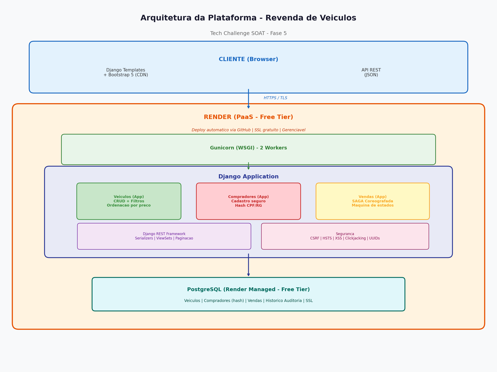

# Desenho de Arquitetura - Plataforma de Revenda de Veículos

## 1. Visão Geral

A plataforma foi construída como uma aplicação web monolítica utilizando Django + Django REST Framework, priorizando simplicidade, economia de recursos e facilidade de deploy em serviços gratuitos na nuvem.

## 2. Diagrama de Arquitetura

O diagrama acima apresenta a visão completa da solução em camadas:

1. **Camada Cliente**: Browser do usuário acessando o frontend (Django Templates + Bootstrap 5) ou consumindo a API REST (JSON).
2. **Camada de Transporte**: Toda comunicação é feita via HTTPS/TLS, com certificado SSL gerenciado automaticamente pelo Render.
3. **Camada de Aplicação**: Django Application rodando sobre Gunicorn (WSGI) com 2 workers, contendo 3 apps (Veículos, Compradores, Vendas) + Django REST Framework + módulo de Segurança.
4. **Camada de Dados**: PostgreSQL gerenciado pelo Render (free tier) armazenando dados de veículos, compradores (com hashes), vendas e histórico de auditoria.

## 3. Componentes e Justificativas

### 3.1 Django + Django REST Framework
- **Por que escolhemos**: Framework Python maduro, com ORM robusto, sistema de autenticação integrado, admin automático e ecossistema rico. Ideal para prototipação rápida com qualidade de produção.
- **Economia de recursos**: Uma única aplicação serve tanto a API REST quanto o frontend (templates), eliminando a necessidade de um servidor frontend separado. Isso reduz custos e complexidade operacional.
- **Priorização de serviços gerenciáveis**: O Django Admin já fornece uma interface de administração completa sem desenvolvimento adicional.

### 3.2 Render (PaaS) — Serviço Gerenciável na Nuvem
- **Por que escolhemos**: Oferece plano gratuito com PostgreSQL incluso, deploy automático via GitHub, SSL gratuito e escalabilidade. É um serviço **gerenciável (managed)** que elimina completamente a necessidade de gerenciar infraestrutura (servidores, patches, escalabilidade).
- **Serverless/Gerenciável**: O Render gerencia o servidor, certificados SSL, banco de dados, backups e deploys automaticamente. A aplicação é deployada com um simples push no GitHub.
- **Alternativas consideradas e descartadas**:
  - Railway: free tier muito limitado em horas de execução
  - Fly.io: requer cartão de crédito mesmo para o plano gratuito
  - Heroku: removeu o plano gratuito em 2022
  - AWS Lambda + API Gateway: complexidade excessiva para o escopo, custo potencial com uso

### 3.3 PostgreSQL (Render Managed) — Banco de Dados Gerenciável
- **Por que escolhemos**: Banco relacional robusto com suporte nativo a UUIDs, transações ACID (essenciais para o fluxo SAGA com `SELECT_FOR_UPDATE`), e disponível gratuitamente no Render.
- **Segurança nativa**: Conexão criptografada via SSL, backups automáticos, isolamento de rede. O Render gerencia patches e atualizações de segurança.
- **Alternativa ao DynamoDB/NoSQL**: Escolhemos SQL por causa da necessidade de transações ACID com locks pessimistas no fluxo de reserva/venda, o que seria muito mais complexo em bancos NoSQL.

### 3.4 WhiteNoise — Arquivos Estáticos
- **Por que escolhemos**: Serve arquivos estáticos diretamente do Django em produção, eliminando a necessidade de um CDN (CloudFront) ou servidor Nginx separado. Compressão automática (gzip/brotli) para performance.
- **Economia**: Zero custo adicional, zero configuração adicional de infraestrutura.

### 3.5 Gunicorn — Servidor WSGI
- **Por que escolhemos**: Servidor WSGI de produção para Python, leve e eficiente. Configurado com 2 workers para se adequar ao plano gratuito do Render (512MB RAM).

## 4. Serviços de Segurança na Nuvem

### 4.1 Render SSL/TLS (Serviço de Segurança na Nuvem)
- **O que é**: O Render fornece certificados SSL/TLS gratuitos e automáticos (Let's Encrypt) para todas as aplicações.
- **Por que usamos**: Garante que toda comunicação entre cliente e servidor é criptografada, prevenindo ataques man-in-the-middle, sniffing de dados e interceptação de credenciais. É um serviço de segurança gerenciado pela nuvem — não requer configuração manual de certificados.
- **Configuração**: `SECURE_SSL_REDIRECT = True` redireciona automaticamente HTTP para HTTPS.

### 4.2 Django Security Middleware (Segurança de Aplicação)
- **SecurityMiddleware**: Adiciona headers HTTP de segurança automaticamente:
  - `Strict-Transport-Security` (HSTS): Força HTTPS por 1 ano, prevenindo downgrade attacks
  - `X-Content-Type-Options: nosniff`: Previne MIME-type sniffing
  - `X-XSS-Protection`: Ativa filtro XSS do browser
- **CsrfViewMiddleware**: Token CSRF em cada formulário, prevenindo ataques Cross-Site Request Forgery
- **ClickjackingMiddleware**: `X-Frame-Options: DENY` previne que a aplicação seja embutida em iframes maliciosos
- **Por que usamos**: São proteções padrão da indústria contra os ataques web mais comuns (OWASP Top 10). O Django já fornece essas proteções integradas — basta habilitá-las.

### 4.3 Hashing de Dados Sensíveis (Segurança de Dados)
- **O que é**: CPF e RG são armazenados como hashes SHA-256 (função de hash criptográfica irreversível). Apenas o CPF mascarado (`***.***.*XX-XX`) é visível na interface.
- **Por que usamos**: Mesmo em caso de vazamento completo do banco de dados, é computacionalmente inviável recuperar os documentos originais a partir dos hashes. Essa é uma medida de proteção exigida pela LGPD para dados sensíveis.

### 4.4 Configuração via Variáveis de Ambiente
- **O que é**: SECRET_KEY, DATABASE_URL, FIELD_ENCRYPTION_KEY e demais configurações sensíveis são gerenciadas via variáveis de ambiente (python-decouple).
- **Por que usamos**: Seguimos o princípio dos 12-Factor Apps — nenhum segredo é armazenado no código-fonte, prevenindo exposição acidental em repositórios públicos.

### 4.5 Render Network Isolation (Segurança de Rede)
- **O que é**: O PostgreSQL no Render é acessível apenas internamente, dentro da rede privada do Render.
- **Por que usamos**: O banco de dados não tem IP público, prevenindo ataques diretos ao banco. Apenas a aplicação Django consegue se conectar.

## 5. Padrões de Projeto Utilizados

| Padrão | Onde é usado | Justificativa |
|--------|-------------|---------------|
| Repository Pattern | ORM do Django | Camada de abstração de dados, desacoplando lógica de negócio do banco |
| Service Layer | `vendas/services.py` | Lógica de negócio isolada das views, facilitando testes e manutenção |
| State Machine | Status de Venda | Transições controladas entre estados, com validação em cada mudança |
| SAGA Coreografada | Fluxo de compra | Cada etapa é uma transação independente com compensação automática |
| Audit Log | `HistoricoVenda` | Registro imutável de cada transição de estado para rastreabilidade |
| DTO (Serializers) | DRF Serializers | Controle de exposição de dados — dados sensíveis nunca são retornados |
