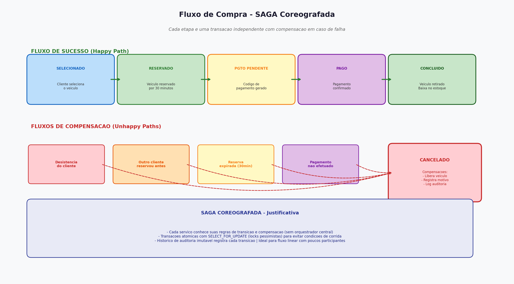

# Relatório de Orquestração SAGA

## Diagrama do Fluxo SAGA



O diagrama acima ilustra o fluxo completo de compra (happy path) e todos os cenários de compensação (unhappy paths) implementados na plataforma.

## 1. Tipo de SAGA Escolhido: Coreografia (Choreography)

### 1.1 Justificativa da Escolha

Para este projeto, foi escolhida a **SAGA Coreografada** ao invés da SAGA Orquestrada, pelas seguintes razões:

#### Razões Técnicas
1. **Arquitetura Monolítica**: Como a aplicação é um monolito Django (não microsserviços), não há necessidade de um orquestrador central separado. Cada serviço (service layer) conhece suas próprias regras de transição e compensação.

2. **Simplicidade**: A coreografia é mais simples de implementar em aplicações monolíticas, onde todas as transações ocorrem no mesmo banco de dados.

3. **Economia de Recursos**: Não requer um serviço de orquestração separado (como um message broker - RabbitMQ, Kafka), reduzindo custos de infraestrutura — essencial para deploy em plano gratuito.

4. **Acoplamento Baixo**: Cada etapa do processo é independente e contém sua própria lógica de compensação, facilitando manutenção e testes.

#### Razões de Negócio
1. **Fluxo Linear**: O processo de compra é essencialmente linear (selecionar → reservar → pagar → retirar), sem ramificações complexas que justificariam um orquestrador.

2. **Poucos Participantes**: Apenas 3 entidades participam (Veículo, Comprador, Venda), tornando a coreografia gerenciável.

3. **Compensações Simples**: As ações compensatórias são diretas (liberar reserva, cancelar venda), sem necessidade de coordenação complexa.

## 2. Fluxo da SAGA Implementada

### 2.1 Fluxo de Sucesso (Happy Path)

```
┌──────────────┐    ┌──────────────┐    ┌───────────────────┐    ┌──────────────┐    ┌──────────────┐
│  SELECIONADO │───▶│  RESERVADO   │───▶│PAGAMENTO_PENDENTE │───▶│     PAGO     │───▶│  CONCLUÍDO   │
│              │    │              │    │                   │    │              │    │              │
│ Cliente      │    │ Veículo      │    │ Código de         │    │ Pagamento    │    │ Veículo      │
│ seleciona    │    │ reservado    │    │ pagamento         │    │ confirmado   │    │ retirado     │
│ veículo      │    │ por 30 min   │    │ gerado            │    │              │    │ Status:      │
│              │    │              │    │                   │    │              │    │ VENDIDO      │
└──────────────┘    └──────────────┘    └───────────────────┘    └──────────────┘    └──────────────┘
```

### 2.2 Fluxos de Compensação (Unhappy Paths)

```
                         CANCELAMENTO (qualquer etapa)
                    ┌─────────────────────────────────────┐
                    │                                     ▼
┌──────────────┐    │   ┌──────────────┐              ┌──────────────┐
│  SELECIONADO │────┤   │  RESERVADO   │──────────────▶│  CANCELADO   │
│              │    │   │              │              │              │
└──────────────┘    │   └──────────────┘              │ Compensação: │
                    │   ┌───────────────────┐         │ - Libera     │
                    │   │PAGAMENTO_PENDENTE │─────────▶│   veículo    │
                    │   │                   │         │ - Registra   │
                    │   └───────────────────┘         │   motivo     │
                    │   ┌──────────────┐              │ - Log audit  │
                    └───│     PAGO     │──────────────▶│              │
                        │              │              └──────────────┘
                        └──────────────┘
```

### 2.3 Cenários de Compensação

| Cenário | Etapa | Compensação |
|---------|-------|-------------|
| Veículo já reservado por outro | Reserva | Cancela venda automaticamente, registra motivo |
| Reserva expirada (>30 min) | Pagamento | Libera veículo, cancela venda |
| Pagamento não efetuado | Pagamento | Libera veículo, cancela venda |
| Cliente desiste | Qualquer | Libera veículo (se reservado), cancela venda |
| Código de pagamento inválido | Confirmação | Rejeita operação, mantém status anterior |

## 3. Implementação Técnica

### 3.1 Transações Atômicas
Cada etapa da SAGA é envolvida em `transaction.atomic()` com `SELECT_FOR_UPDATE` para garantir:
- **Atomicidade**: A etapa completa inteiramente ou faz rollback.
- **Isolamento**: Locks pessimistas previnem condições de corrida.
- **Consistência**: O estado do veículo e da venda são sempre consistentes.

### 3.2 Histórico de Auditoria
Cada transição de estado é registrada na tabela `HistoricoVenda`:
- Status anterior e novo
- Descrição da ação
- Timestamp da transição

Isso permite rastrear completamente o fluxo de cada venda, incluindo compensações.

### 3.3 Service Layer (`vendas/services.py`)
A lógica de negócio é isolada em funções de serviço:
- `selecionar_veiculo()` — Etapa 1
- `reservar_veiculo()` — Etapa 2 (com compensação)
- `gerar_codigo_pagamento()` — Etapa 3
- `confirmar_pagamento()` — Etapa 4 (com compensação)
- `concluir_venda()` — Etapa 5
- `cancelar_venda()` — Compensação geral
- `_compensar_reserva()` — Compensação de reserva expirada

### 3.4 Idempotência
Cada operação verifica o status atual antes de executar, garantindo que transições inválidas sejam rejeitadas com mensagens de erro claras.

## 4. Comparação: Coreografia vs. Orquestração

| Aspecto | Coreografia (Escolhida) | Orquestração |
|---------|------------------------|--------------|
| Complexidade | Baixa | Alta |
| Infraestrutura | Nenhuma adicional | Message broker necessário |
| Custo | Zero adicional | Servidor de orquestração |
| Acoplamento | Baixo | Centralizado |
| Rastreabilidade | Via logs de auditoria | Via orquestrador |
| Escalabilidade | Limitada (monolito) | Alta (microsserviços) |
| Adequação ao projeto | Ideal (fluxo linear, poucos serviços) | Excessivo para o escopo |

## 5. Evolução Futura

Se a aplicação evoluir para microsserviços, recomenda-se migrar para **SAGA Orquestrada** com:
- **Apache Kafka** ou **RabbitMQ** como message broker
- **Serviço de Orquestração** dedicado para coordenar o fluxo
- **Event Sourcing** para rastreabilidade completa
- **Compensações assíncronas** para maior resiliência
