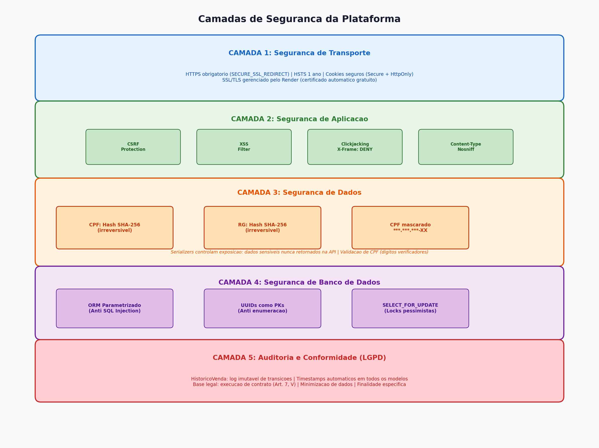

# Relatório de Segurança de Dados

## Visão Geral das Camadas de Segurança

A plataforma implementa **5 camadas de segurança** independentes e complementares, desde o transporte de dados até a conformidade com a LGPD. Cada camada é detalhada nas seções abaixo.

## 1. Dados Armazenados pela Solução

### 1.1 Dados de Veículos
| Campo | Tipo | Sensibilidade |
|-------|------|---------------|
| Marca, Modelo, Ano, Cor | Texto | Pública |
| Preço | Decimal | Pública |
| Placa | Texto (unique) | Moderada |
| Chassi | Texto (unique) | Moderada |
| Quilometragem | Inteiro | Pública |
| Status | Enum | Pública |

### 1.2 Dados de Compradores
| Campo | Tipo | Sensibilidade | Tratamento |
|-------|------|---------------|------------|
| Nome | Texto | Pessoal (LGPD) | Armazenado em texto plano |
| Email | Texto | Pessoal (LGPD) | Armazenado em texto plano |
| Telefone | Texto | Pessoal (LGPD) | Armazenado em texto plano |
| **CPF** | **Hash SHA-256** | **Sensível (LGPD)** | **Hash irreversível + mascaramento** |
| **RG** | **Hash SHA-256** | **Sensível (LGPD)** | **Hash irreversível** |
| Endereço | Texto | Pessoal (LGPD) | Armazenado em texto plano |
| Data de Nascimento | Data | Pessoal (LGPD) | Armazenado em texto plano |

### 1.3 Dados de Vendas
| Campo | Tipo | Sensibilidade |
|-------|------|---------------|
| Código de Pagamento | UUID | Confidencial |
| Preço de Venda | Decimal | Comercial |
| Status da Venda | Enum | Operacional |
| Timestamps | DateTime | Operacional |
| Histórico/Auditoria | Texto | Operacional |

## 2. Dados Sensíveis Identificados

### 2.1 Dados Pessoais Sensíveis (LGPD Art. 5º, II)
- **CPF**: Documento de identificação fiscal. Armazenado como hash SHA-256 (irreversível). Apenas os 4 últimos dígitos são visíveis (mascaramento: `***.***.*XX-XX`).
- **RG**: Documento de identificação civil. Armazenado como hash SHA-256 (irreversível). Nunca exibido na interface.

### 2.2 Dados Pessoais (LGPD Art. 5º, I)
- Nome, email, telefone, endereço, data de nascimento: dados pessoais que permitem identificação do titular.

## 3. Políticas de Acesso a Dados

### 3.1 Princípio do Menor Privilégio
- **API de Leitura**: Nunca expõe CPF ou RG em texto plano. Apenas o CPF mascarado é retornado.
- **API de Criação**: CPF e RG são recebidos em texto plano apenas no momento do cadastro, imediatamente convertidos em hash e descartados.
- **Admin Django**: Campos sensíveis (cpf_hash, rg_hash) são readonly e não editáveis.

### 3.2 Serializers com Controle de Exposição
- `CompradorCreateSerializer`: Aceita CPF/RG em texto plano (write-only), gera hashes.
- `CompradorSerializer`: Retorna apenas CPF mascarado, nunca hashes completos.

### 3.3 Validação de Dados
- CPF: Validação algorítmica (dígitos verificadores) antes do armazenamento.
- RG: Validação de formato mínimo.
- Email: Validação de formato e unicidade.

## 4. Políticas de Segurança da Operação

### 4.1 Segurança de Transporte
- **HTTPS obrigatório**: `SECURE_SSL_REDIRECT = True` em produção.
- **HSTS**: `SECURE_HSTS_SECONDS = 31536000` (1 ano), incluindo subdomínios.
- **Cookies seguros**: `SESSION_COOKIE_SECURE = True`, `CSRF_COOKIE_SECURE = True`.

### 4.2 Segurança de Aplicação
- **CSRF Protection**: Token CSRF em todos os formulários.
- **XSS Protection**: `SECURE_BROWSER_XSS_FILTER = True`.
- **Content-Type Sniffing**: `SECURE_CONTENT_TYPE_NOSNIFF = True`.
- **Clickjacking**: `X_FRAME_OPTIONS = 'DENY'`.
- **Secret Key**: Gerada automaticamente via variável de ambiente, nunca no código.

### 4.3 Segurança de Banco de Dados
- **Conexão criptografada**: PostgreSQL via SSL no Render.
- **ORM parametrizado**: Prevenção de SQL Injection via Django ORM.
- **UUIDs como chaves primárias**: Previne enumeração sequencial de recursos.
- **SELECT_FOR_UPDATE**: Locks pessimistas para operações concorrentes (reservas).

### 4.4 Auditoria
- **HistoricoVenda**: Log imutável de todas as transições de estado.
- **Timestamps automáticos**: `criado_em` e `atualizado_em` em todos os modelos.

## 5. Riscos e Ações de Mitigação

### 5.1 Risco: Vazamento de Banco de Dados
- **Impacto**: Alto - dados pessoais expostos.
- **Mitigação**: CPF e RG armazenados como hash SHA-256 irreversível. Mesmo com acesso ao banco, não é possível recuperar os documentos originais.
- **Mitigação adicional**: Mascaramento de CPF na interface (apenas últimos 4 dígitos visíveis).

### 5.2 Risco: Condição de Corrida na Reserva
- **Impacto**: Médio - dois clientes reservam o mesmo veículo.
- **Mitigação**: `SELECT_FOR_UPDATE` com locks pessimistas no banco de dados. Transações atômicas (`transaction.atomic()`).

### 5.3 Risco: Reserva Sem Pagamento (Bloqueio de Estoque)
- **Impacto**: Médio - veículo fica indisponível indefinidamente.
- **Mitigação**: Expiração automática de reservas em 30 minutos. Compensação SAGA libera o veículo automaticamente.

### 5.4 Risco: Acesso Não Autorizado à API
- **Impacto**: Alto - manipulação de dados.
- **Mitigação**: Para produção, recomenda-se implementar autenticação JWT ou OAuth2 via Django REST Framework. Atualmente a API é aberta para facilitar o desenvolvimento/avaliação.

### 5.5 Risco: Ataque de Força Bruta em CPF
- **Impacto**: Médio - CPFs têm espaço limitado (11 dígitos).
- **Mitigação**: Hash SHA-256 sem salt dificulta ataques. Para produção, recomenda-se adicionar salt (HMAC) ou usar bcrypt para documentos.

### 5.6 Risco: Injeção de SQL
- **Impacto**: Crítico.
- **Mitigação**: Django ORM com queries parametrizadas. Nenhuma query SQL raw é utilizada.

## 6. Conformidade LGPD

- **Base Legal**: Execução de contrato (Art. 7º, V) - necessário para processo de compra e documentação veicular.
- **Minimização**: Apenas dados estritamente necessários são coletados.
- **Finalidade**: Dados utilizados exclusivamente para o processo de compra e documentação.
- **Transparência**: CPF mascarado indica ao titular que seus dados estão protegidos.
- **Segurança**: Medidas técnicas de proteção implementadas (hashing, HTTPS, headers de segurança).
